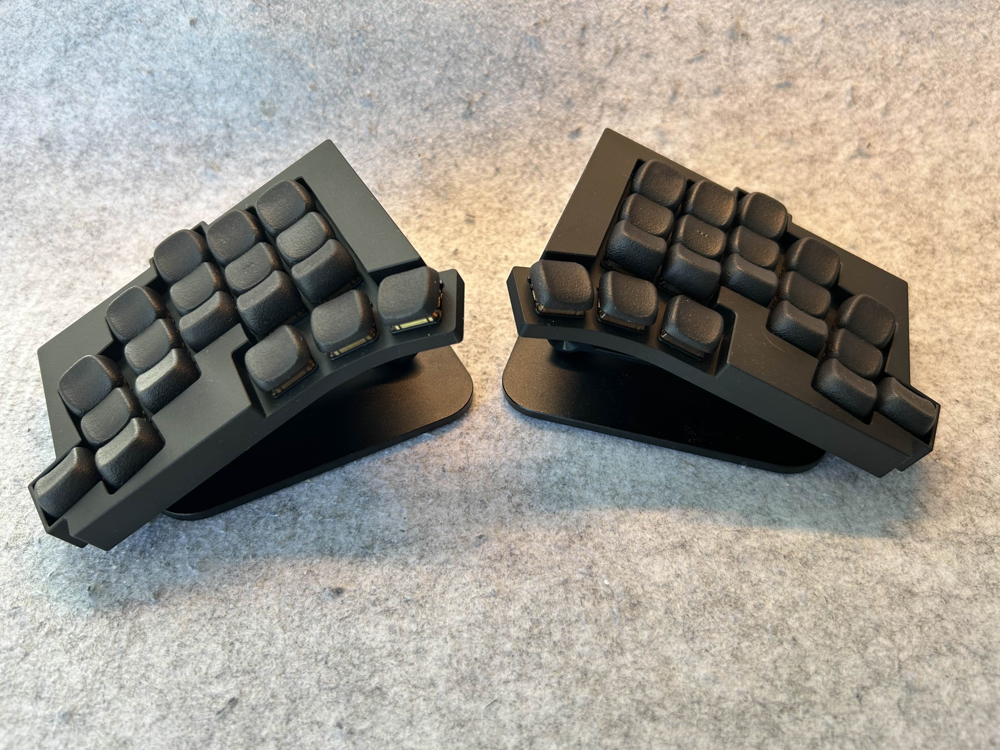
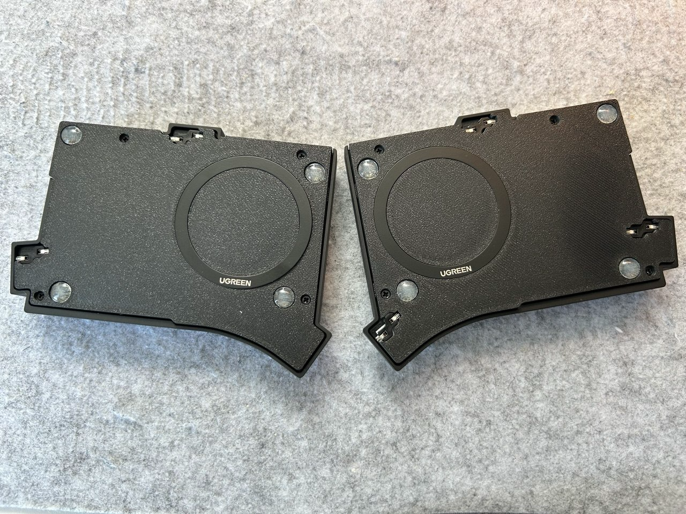
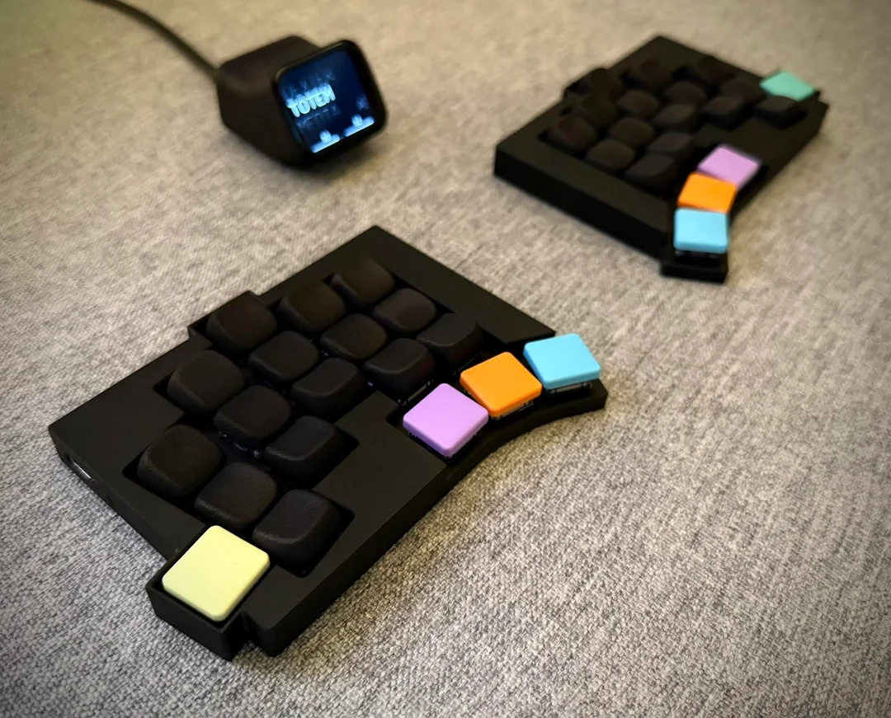
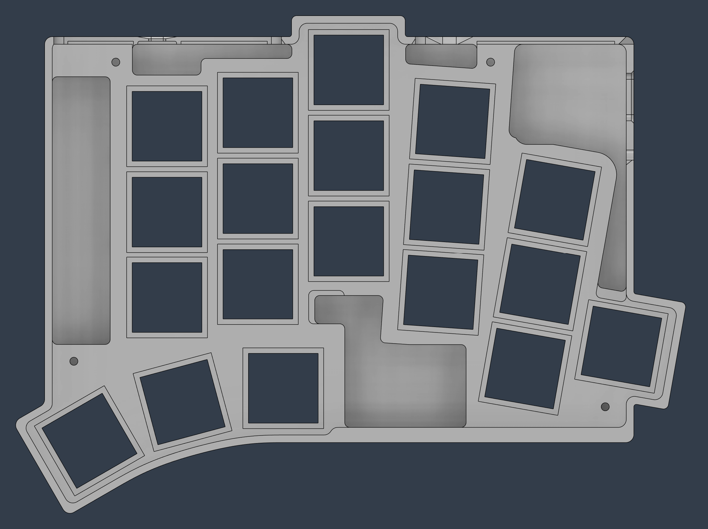
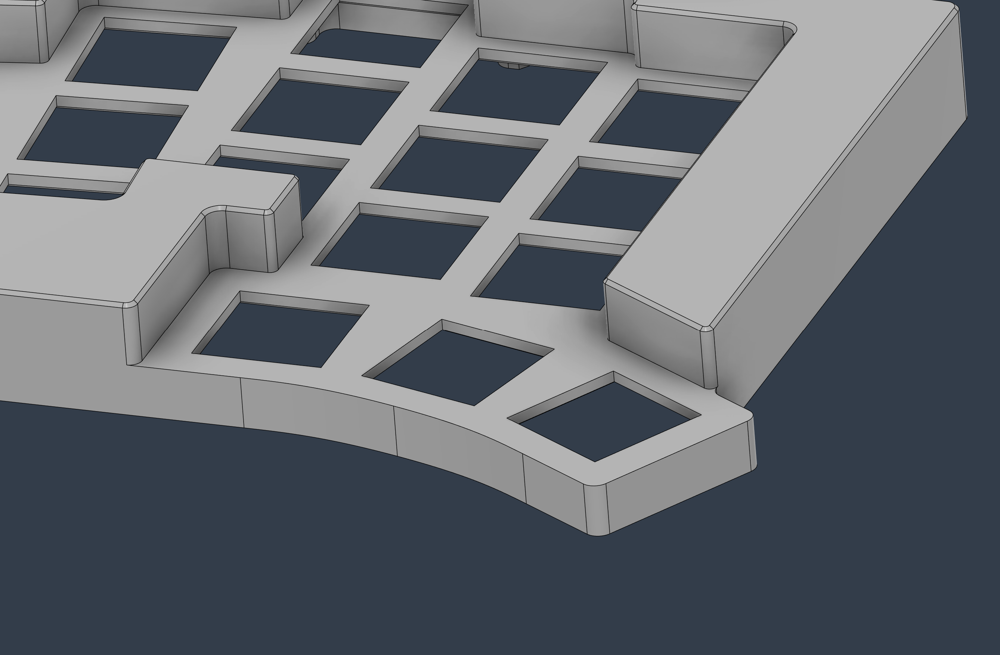
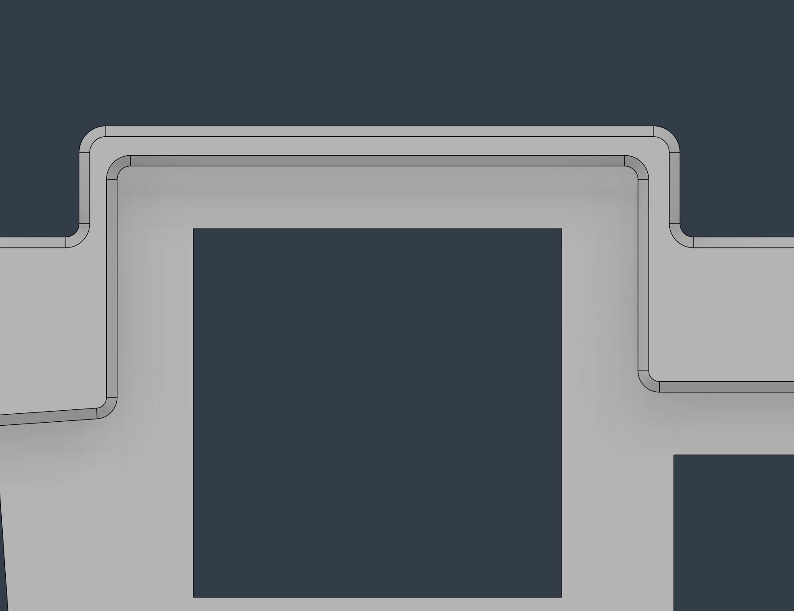
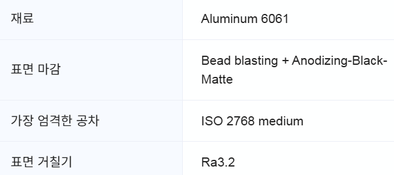

# Alu_totem

Added a magsafe backplate to the Alu_totem by [Dexter-KBD](https://github.com/Dexter-KBD/Alu_totem).

https://www.reddit.com/r/ErgoMechKeyboards/comments/1k2mifg/alu_totem_klp_lame_dongle/?utm_source=share&utm_medium=web3x&utm_name=web3xcss&utm_term=1&utm_content=share_button

  If you have any questions, please leave a comment on the post.
   

Fillets were applied for CNC machining. Although the switch mounting section doesn't show fillets in the drawing, a 0.5mm radius fillet will inevitably be applied during manufacturing. You will receive a confirmation email from JLC CNC when placing an order to verify this detail.

When placing your order, make sure to select the threaded holes option and attach the PNG file. While this might seem a bit tricky at first, it’s actually a simple step. I’ll share a reference image that you can show during the ordering process — that should make things clear.
   

I made the corners of the thumb cluster more rounded. This change is purely based on my personal preference.
   

   

These are the options I selected when placing the order. I printed the bottom file using MJF. If you want something heavier and sturdier, you can also order it in aluminum. However, I chose nylon material to achieve better wireless reception and reduce the risk of shorts.
